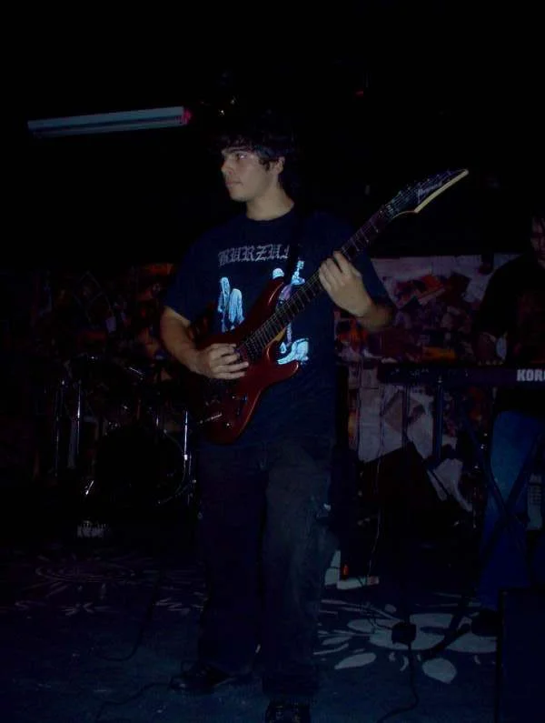
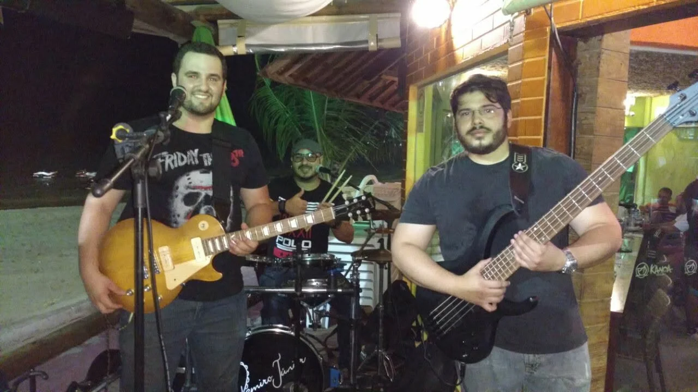
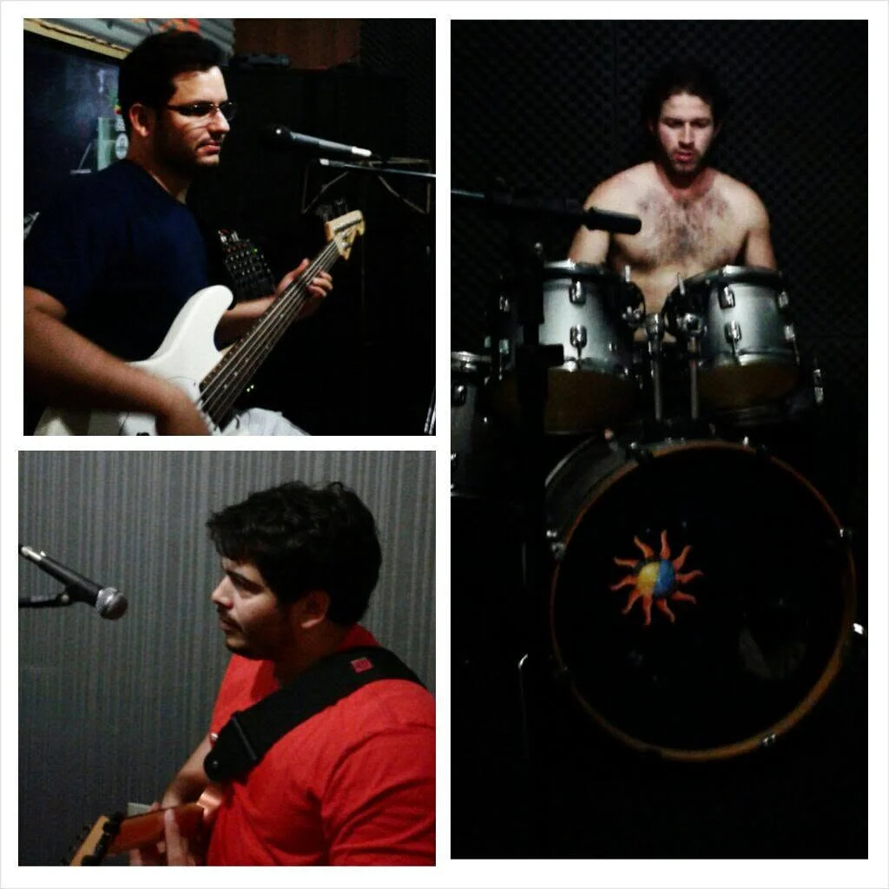

Meu nome é Valber Gregory e este espaço nasce do desejo de explorar os encontros entre economia, cultura, entretenimento, história e dados. Pretendo analisar livros, filmes, séries, histórias em quadrinhos, premiações, festivais, eventos, editais, políticas públicas e outras manifestações culturais, observando seus conteúdos e as condições econômicas, sociais e históricas que possibilitam sua criação, circulação, reconhecimento e permanência.

A proposta de criticar não significa apenas apontar defeitos. Compreendo a crítica como um exercício de reflexão, capaz de questionar, contextualizar, reconhecer méritos, identificar contradições e, quando for justo, elogiar boas obras, iniciativas e políticas culturais. Um livro, um filme, uma série ou uma história em quadrinhos pode ser examinado por suas escolhas criativas, mas também pela forma como foi financiado, produzido, distribuído e recebido pelo público. Da mesma maneira, premiações, eventos e editais podem ser discutidos a partir dos incentivos que criam, dos critérios que adotam e das oportunidades que ajudam a distribuir ou concentrar.

O olhar econômico será um dos principais elementos dessas análises. Livros, filmes, séries, músicas e histórias em quadrinhos são expressões da criatividade humana, mas também dependem de trabalho, investimento, tecnologia, instituições, direitos autorais, canais de distribuição e formação de público. A economia não explica sozinha a cultura, haja vista que valores, identidades, afetos, conflitos e memórias não podem ser reduzidos a preços ou indicadores. Contudo, ela oferece instrumentos importantes para compreender por que algumas obras encontram espaço, enquanto outras permanecem invisíveis, como se formam os mercados culturais e de que maneira as escolhas públicas e privadas influenciam aquilo que chega até nós.

A perspectiva histórica também será indispensável, pois nenhuma manifestação cultural surge completamente isolada de seu tempo. Obras, movimentos, estilos, premiações e políticas carregam marcas das sociedades que os produziram. Dessarte, pretendo relacionar os fatos culturais às transformações econômicas, sociais, políticas e tecnológicas que contribuíram para sua formação. Sempre que possível, utilizarei dados, pesquisas e evidências para ampliar a discussão, sem reduzir a experiência cultural a números.

Minha relação pessoal com a cultura passa especialmente pela música. Apresento-me, contudo, como um músico totalmente amador e nada mais do que um entusiasta envergonhado. Possuo formação básica em escola de música e nunca tive a pretensão de construir uma carreira artística. A música sempre esteve presente em minha vida como espaço de curiosidade, convivência, aprendizado e diversão.

Entre 2001 e 2007, toquei em algumas bandas do cenário underground de Maceió, entre elas Slive e Heimdall, que posteriormente passou a se chamar Mater Sin, além de ter participado de vários projetos particulares. Durante esse período, transitei por diferentes vertentes do rock, como grunge, pós-grunge, punk, metal, black metal e outros estilos ligados ao rock'n'roll. Toquei guitarra e violão, mas, com o tempo, também criei um carinho especial pelo baixo, instrumento com o qual vivi parte importante dessas experiências.

Ao longo desses anos, tive a oportunidade de tocar em vários locais de Maceió. Foram apresentações, ensaios e encontros realizados de forma absolutamente despretensiosa, movidos pelo prazer de tocar e pela convivência com outras pessoas que compartilhavam o mesmo entusiasmo. Essa passagem pelo cenário musical permitiu que eu conhecesse um pouco das dificuldades enfrentadas por músicos e produtores independentes, desde a aquisição de instrumentos e equipamentos até a busca por espaços, a organização de apresentações, a conciliação de horários e a formação de público.

Após alguns anos afastado, voltei a tocar entre 2016 e 2017 com Arthur Magalhães e Ramiro Júnior, aos quais agradeço pela excelente época que vivemos. O reencontro com a música trouxe novamente o prazer dos ensaios, das apresentações e da convivência que se forma em torno de um projeto musical, ainda que sem qualquer pretensão profissional.

Atualmente, estou novamente afastado da prática musical por absoluta falta de tempo para me dedicar a ela como gostaria. Ainda assim, acompanho o cenário e continuo observando muitas de suas mudanças, dificuldades e possibilidades. Espero retomar em breve esse hobby, novamente sem grandes pretensões, apenas pelo prazer de tocar, aprender e preservar uma dimensão da vida que sempre me foi muito próxima.

Essa experiência também influencia a maneira como pretendo tratar a cultura neste site. Participar, mesmo de forma amadora, de bandas e projetos musicais permitiu que eu percebesse como a produção cultural depende de redes de colaboração, pequenos empreendedores, casas de eventos, técnicos, artistas e públicos dispostos a manter vivas manifestações que nem sempre encontram apoio institucional ou retorno financeiro. O cenário underground evidencia, de maneira especialmente clara, que por trás de cada apresentação existe uma combinação de trabalho, tempo, custos, riscos, afetos e escolhas.

As fotografias reunidas neste espaço registram alguns desses momentos. Mais do que lembranças pessoais, elas mostram uma pequena parte da vida musical independente de Maceió, formada por ensaios, apresentações, instrumentos, amizades, improvisos e espaços que acolheram diferentes experiências artísticas. Elas ajudam a recordar que toda produção cultural possui uma dimensão humana e cotidiana, muitas vezes anterior ao reconhecimento, ao mercado e às instituições.

Este blog será, portanto, um lugar para discutir, refletir, criticar e elogiar a cultura a partir de suas múltiplas dimensões. Pretendo observar tanto as obras quanto as estruturas que as cercam, aproximando experiências pessoais, história, economia e dados. Destarte, a intenção não é oferecer respostas definitivas, mas construir perguntas mais concretas sobre aquilo que produzimos, consumimos, valorizamos e preservamos, reconhecendo a cultura como trabalho, expressão, memória e parte essencial da construção humana.

*As demais fotografias estão na [galeria da seção Música](../../musica/).*
